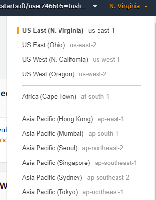

# EC2 (Elastic Compute Cloud)
 
  An EC2 instance is nothing but a *virtual server* in Amazon Web services terminology. It stands for Elastic Compute Cloud.
  It is a web service where an AWS subscriber can request and provision a compute server in AWS cloud.
  The instance will be charged per hour with different rates based on the type of the instance chosen. 
  AWS provides multiple instance types for the respective business needs of the user.
  Thus, we can rent an instance based on our own CPU and memory requirements and use it as long as we want.
  we can terminate the instance when it’s no more used and save on costs. 

 In this information we will see:-
- [Login and access to AWS services](https://console.aws.amazon.com/console/home?region=us-east-1#)
- [Choose AMI](https://console.aws.amazon.com/ec2/v2/home?region=us-east-1#LaunchInstanceWizard:)
- [Choose EC2 Instance Types](https://console.aws.amazon.com/ec2/v2/home?region=us-east-1#LaunchInstanceWizard:)
- [Configure Instance](https://console.aws.amazon.com/ec2/v2/home?region=us-east-1#LaunchInstanceWizard:)
- [Add Storage](https://console.aws.amazon.com/ec2/v2/home?region=us-east-1#LaunchInstanceWizard:)
- [Tag Instance](https://console.aws.amazon.com/ec2/v2/home?region=us-east-1#LaunchInstanceWizard:)
- [Configure Security Groups](https://console.aws.amazon.com/ec2/v2/home?region=us-east-1#LaunchInstanceWizard:)
- [Review Instances](https://console.aws.amazon.com/ec2/v2/home?region=us-east-1#LaunchInstanceWizard:)
  - [Find Instance Types](https://console.aws.amazon.com/ec2/v2/home?region=us-east-1#LaunchInstanceWizard:)
  - [Configure the instance](https://console.aws.amazon.com/ec2/v2/home?region=us-east-1#LaunchInstanceWizard:)
  - [Review your instance](https://console.aws.amazon.com/ec2/v2/home?region=us-east-1#LaunchInstanceWizard:)
 
## Login and access to AWS services

**Step 1)** In this step,

- Login to your AWS account and go to the AWS Services tab at the top left corner.
 
- Here, you will see all of the AWS Services categorized as per their area viz. Compute, Storage, Database, etc.
  For creating an EC2 instance, we have to choose Compute EC2 as in the next step.
  
  

- Open all the services and click on `EC2` under Compute services. This will launch the dashboard of EC2.
- Here is the EC2 dashboard. Here you will get all the information in gist about the AWS EC2 resources running.

**Step 2)** On the top right corner of the EC2 dashboard, choose the AWS Region in which you want to provision the EC2 server.

- Here we are selecting N. Virginia. AWS provides 10 Regions all over the globe.

**Step 3)** In this step

- Once your desired Region is selected, come back to the EC2 Dashboard.

- Click on `Launch Instance` button in the section of Create Instance.

- Instance creation wizard page will open as soon as you click `Launch Instance`. 

## Choose AMI

**Step 1)** In this step we will do,

**1.** You will be asked to choose an AMI of your choice. (An AMI is an Amazon Machine Image. It is a template basically of an Operating 
       System platform which you can use as a base to create your instance). Once you launch an EC2 instance from your preferred AMI,
       the instance will automatically be booted with the desired OS. 

**2.** Here we are choosing the default Amazon Linux (64 bit) AMI.

## Choose EC2 Instance Types

**Step 1)** In the next step, you have to choose the type of instance you require based on your business needs.

**1.** We will choose t2.micro instance type, which is a 1vCPU and 1GB memory server offered by AWS.

**2.** Click on `Configure Instance Details` for further configurations.

  
- In the next step of the wizard, enter details like no. of instances you want to launch at a time.

- Here we are launching one instance.

## Configure Instance

**Step 1)** No. of instances- we can provision up to 20 instances at a time. Here we are launching one instance.

**Step 2)** In this step,

- We are not changing any parameter so keep it default.

- Click on `Add Storage` to add data volumes to your instance in next step.

## Add Storage

**Step 1)** In this step we do following things,

- In the Add Storage step, you'll see that the instance has been automatically provisioned a General Purpose SSD root volume of 8GB.
 ( Maximum volume size we can give to a General Purpose volume is 16GB)

- You can change your volume size, add new volumes, change the volume type, etc.

- AWS provides 3 types of EBS volumes- Magnetic, General Purpose SSD, Provisioned IOPs. You can choose a volume type based on your application's IOPs needs.

## Tag Instance

**Step 1)** In this step

- you can tag your instance with a key-value pair (Name),This gives visibility to the AWS account administrator when there are lot number of instances.
- The instances should be tagged based on their department, environment like Dev/SIT/Prod. Etc. this gives a clear view of the costing on the instances 
   under one common tag.
  - Here we have tagged the instance as a `tushar`.
  - Go to `configure Security Groups` later.
  

## Configure Security Groups

**Step 1)** In this next step of configuring Security Groups, you can restrict traffic on your instance ports.
            This is an added firewall mechanism provided by AWS apart from your instance's OS firewall.

You can define open ports and IPs.

- Since our server is a webserver, we will do following things

  - Creating a new Security Group
  - Naming our SG for easier reference
  - Defining protocols which we want enabled on my instance
  - Assigning IPs which are allowed to access our instance on the said protocols
  - Once, the firewall rules are set- `Review and launch`.
   

## Review Instances

**Step 1)** In this step, we will review all our choices and parameters and go ahead to launch our instance.

**Step 2)** In the next step you will be asked to create a key pair to login to you an instance. A key pair is a set of public-private keys.

- AWS stores the private key in the instance, and you are asked to download the private key. Make sure you download the key and keep it safe and secured;
  if it is lost you cannot download it again.
  

 - Create a new key pair
 - Give a name to your key
 - Download and save it in your secured folder

**Step 3)** Once you are done downloading and saving your key, launch your instance.

- You can see the launch status meanwhile.
- You can also see the launch log.

- Click on the `Instances` option on the left pane where you can see the status of the instance as `Pending` for a brief while.
- Once your instance is up and running, you can see its status as `Running` now.
- Note that the instance has received a Private IP from the pool of AWS.

