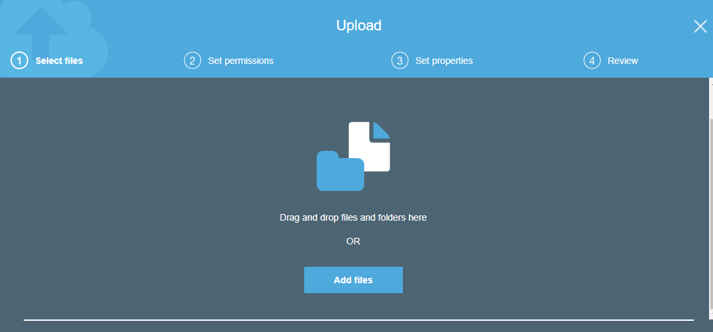

# LAMBDA FUNCTION

```
AWS Lambda is a serverless compute service that runs your code in response to events and automatically manages the underlying compute resources for us.
We can use AWS Lambda to extend other AWS services with custom logic, or create your own back-end services that operate at AWS scale, performance and security.
```


- if you store any file in ec2 you have to pay for storage but in lambda you can store many codes but for storage it will not cost you anything.
- It will charge you only at the time of execution of code.
- For the period a program or code you are running,aws will charge you for CPU and RAM usage.
- Also there will be no charge for Operating System you are using because the service is severless.
- *Scalibility*: Automatic changes of resources according to need for running a code (scale up and scale down).
- *paralization*:It used according to request at the same point of time, many people can use this function at the same time.


## Steps for creating lambda function

- step 1: Go to AWS CONSOLE.Then go to services in the menu bar.
- step 2: select Lambda from compute section or you can search for `Lambda` in search bar.
- step 3: Click on `create function`.


- step 4: select `use blueprint` for existing function provided by aws.after that you can search with keyword wherever function you want.
          here we are searching for `hello world` program.then click on this function of node.js as follow.


- step 5: click on `configure`.
- step 6: now you can name your function. then select `use existing role` and select role from the dropdown.


- step 7: scroll down.and you can see the code in the laguage you have selected.now to create function you can click on 'create function.


 here we can see our function is created.


so click on function again we can see new lambda function is created.


Alternatively you can choose 'author from scratch' while creating a funtcion.
you need to proivde the code and then run.Click on author from scratch then enter the function name.


but now we are using blueprint function.so lets continue with that.

- step 8:click on the function in the list.then Scroll down you will see the code,now you can make changes in the code if you want.
         If you made any changes click on save and then on test.


- step 9: Enter the event name and you can change the key values e.g i have entered choco in place of value1,
          vanilla in the place of value2,butterscotch in value3 and also i have changed the key3 name as test.
          and now you can click on create.


- step 10: You can see on the window i have change key3 value to test,if you will not change this to test then it will give you undefined value at key3.
           and also dont forget to save the changes you have made.then click on test.


- step 11: scroll up and click on details.you will see all the details for execution of code.


- step 12: whenever you do not need a function you can delete the function by selecting it from the list.


# NOW WE WILL SEE LAMBDA AS A EVENT DRIVEN (AUTOMATED) SERVICE

*we are going to fire lambda function whenever any file uploaded to s3.for that we have to follow steps given below*:

1. step 1: Go to the S3 services.
2. step 2: go to Any bucket you want or create bucket and click on the bucket name.
3. step 3: now go to properties menu.there you will find 'event' in the advanced settings.click on the events.
4. step 4: click on `add notification`.


- step 5: give name to the event.select the events details.prefix and suffix are used for event trigger.
          eg if you want to trigger lambda function only if any file name with cdac suffix of cdac prefix is present.
          then you can select `sent to` from the dropdown to which you want send the event trigger and  then selection 
          lambda function present in the dropdown.and then click on `save`.


  so we select this options this will create error as show in picture,


so for that we deselect this other option which we select in one function `All object cretae event` only.

- step 6: now select the event and click save.


- step 7: now open lambda to the new tab.

- step 8: go to your lambda and do some changes then you can find out some difference in execution so that you can differentiate
          between old and new lambda function, after changes click on `save` do not test it.


- step 9: again go to your s3 and upload any one file to the bucket which we already created.



10. step 10: after successfully uploading the file.you can search for 'cloudwatch' in services.open cloudwatch in the new window.
there you can see even fired in the list.


