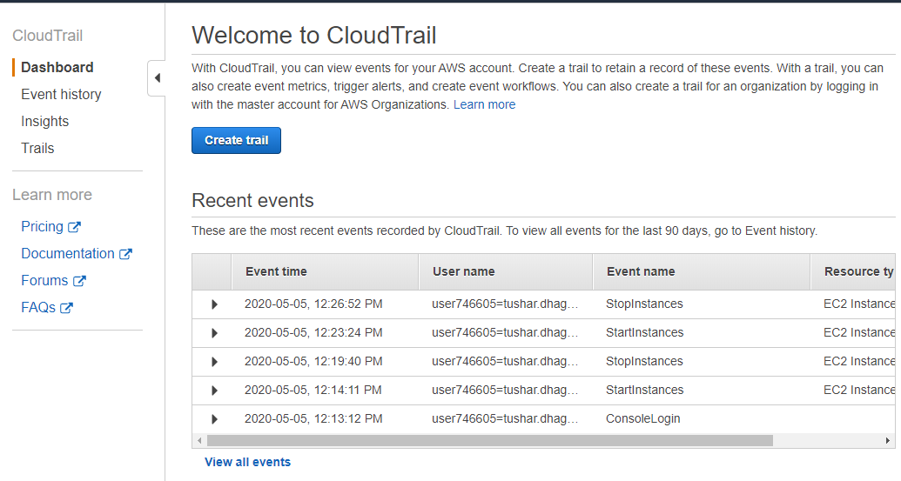
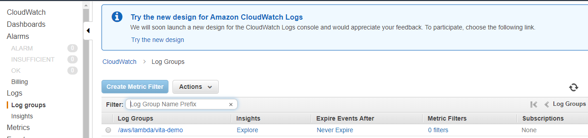

# CLOUDWATCH AND CLOUDTRAIL

## cloudtrail

- Tracks user activity and API usage.
- when you perform any action on AWS UI then log will be stored to cloudtrail.
  - when you select any instance and go to action and click on stop.
  - click on logEvents.

here you can see actions in the cloudtrail.

## cloudwatch

- monitors resource and applications.
- resources like ec2,s3 etc
- applications like webapplications.
- features:
  - store a log. 
  - log search by sql queries. 
  - create a dashboard.

you ca see logs in the cloudwatch.

