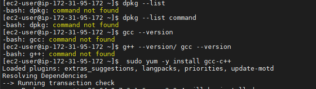
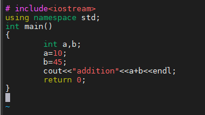
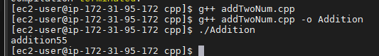

# HOW TO COMPILE AND EXECUTE CPP PROGRAM FILES ON LINUX

*Please follow below steps for compiling program in linux*

- step 1. Open terminal.

- step 2. Check whether you have g++ complier in your system.

*In my system i needed to download it as follow*

There are Two ways You can check for g++ compiler

`$ dpkg --list`

when you run this command you will get list of compiler your system has.in which you can find for g++ compiler.

`g++ --version/ gcc --version`

when you run this command you will get like this message on terminal.

If you are getting error finding g++ compiler then you can run this command

`sudo yum -y install gcc-c++`

using this command you can install g++ compiler.

- step 3: Make one folder name `cpp`

`mkdir cpp`

then go that directory/folder by command

`cd cpp/`

- step 4: Create new cpp file with help of vi editor

`vi addTwoNum.cpp`

press `i` and go in the insert mode,you can check for insert mode at the end of the terminal then write your code in vi editor

after complete the code press *esc* key.after that press *:wq* to write and commmit the changes made to the file.

- step 5: Compile the program

you can compile file by the command below:

`g++ addTwoNum.cpp`

by this command compiler will create one output file to your directory but you can name that file by the command below instead of the command above

`g++ addTwoNum.cpp -o Addition`

so output file will be created with the name of *Addition* and if file have any compile time error or warnings it will show after running of command.

- step 6: Execute you output file

now command is

`./Addition`

this command will give you output.

*This is how we create and run program on linux*

