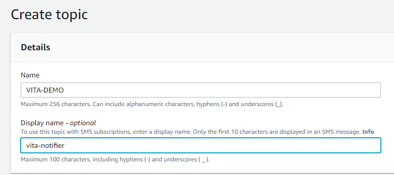
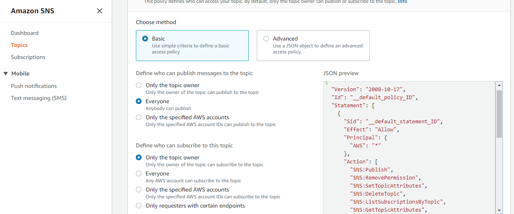

# SNS (Simple Notification Server)

```
Amazon Simple Notification Service (SNS) is a highly available, durable, secure,fully managed pub/sub messaging service
that enables you to decouple microservices,distributed systems, and serverless applications. Amazon SNS provides topics 
for high-throughput, push-based, many-to-many messaging. Using Amazon SNS topics, your publisher systems can fan out messages
to a large number of subscriber endpoints for parallel processing, including Amazon SQS queues, AWS Lambda functions, and HTTP/S webhooks.
Additionally, SNS can be used to fan out notifications to end users using mobile push, SMS, and email.You can get started with
Amazon SNS in minutes by using the AWS Management Console, AWS Command Line Interface (CLI),or AWS Software Development Kit (SDK).
```

## Benefits
   - Reliably deliver messages with durability.
   - Automatically scale your workload 
   - Simplify your architecture with Message Filtering.
   - Keep messages private and secure.

## How it works
  Amazon SNS enables message filtering and fanout to a large number of subscribers, including serverless functions, queues,
  and distributed systems. Additionally, Amazon SNS fans out notifications to end users via mobile push messages, SMS, and email.


 ***Publisher***:- It is basically sender in our condition it is AWS.	
 
 ***Subscriber***:- It is basically receiver i.e us.

## Steps to create Topic

- step 1: Start with go to CONSOLE.
- step 2: you can search for `SNS` in search bar.
- step 3: Now enter a topic and Click on `Create Topic`.


- step 4: now enter name & display name.



- step 5: now define who can pulish message and who can subscribe.



- step 6: In IAM Role present in Delivery status logging click on create new service role.we need to enter ARN for IAM.
          Now we are going to create IAM roles here.


> so right click on create role.it will open new window.on that window u will file creation for two roles do not change anything and       click on Allow.


> now we have to use this role in our topic.so again go to the topic creation window.and select use existing service role
 

Here we are not getting the list for IAM's so we have to go to IAM services window.for that go to services menu.search for IAM.
go to IAM window.click on roles in left side menu.


- step 7: search for SNS in the search.you will get two roles which you have just created.


> select SNSFailureFeedback and the SNSSuccessFeedback go inside copy its ARN and paste it to the IAM role for successful deliveries box   and do it same for IAM role for failuer deliveries.


> Now click on `create topic` then you will see your topic in the list


- step 8: click on create Subscrption as you see in below image.


> select Email from the list of protocol.Enter your email-id.and click on create subscription


- step 9: you will see status for Subscrption is still pending.


- step10: now you have to confirm the subscrprition from the link which is sent to you in your email.


> now you canse status is now confirmed


## Use of SNS to our S3 event.(s3 as publisher)

- step 1: Go inside your already created s3.Go the properties and select Events.click on add notification.
          name the event.select All object create events from the options.then select 'SNS' in sent to options
          and select your created SNS topics from the options.


> now we have one active event


- step 2: now go to overview in menu.upload any after successfull uploading check you get a email or not.


> after confirm this link on email you will see subscribtion is completed


# Use of SNS to our EC2 alarm.(EC2 as publisher)

**step 1:** select 1 ec2 from the list.click on create status check alarm.


> select sent to and select your sns from options.choose your alarm configurations as below image


> stop and start again your EC2 for alarm status change.Now you will get email as per your alarm configurations


